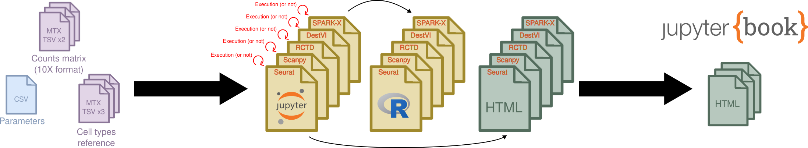

# Pipeline steps

This pipeline is an attempt to run 5 packages for each input sample:

 * [Seurat](https://satijalab.org/seurat/articles/spatial_vignette.html#slide-seq-1): clusters the beads based on their expression and find markers genes
 * [Scanpy](https://scanpy-tutorials.readthedocs.io/en/latest/spatial/integration-scanorama.html): clusters the beads based on their expression and find markers genes
 * [RCTD](https://raw.githack.com/dmcable/spacexr/master/vignettes/spatial-transcriptomics.html): try to annotate the beads with a cell type using a single-cell reference dataset
 * [DestVI](https://docs.scvi-tools.org/en/stable/tutorials/notebooks/DestVI_tutorial.html): try to annotate the beads with a cell type using a single-cell reference dataset
 * [SPARK-X](https://satijalab.org/seurat/articles/spatial_vignette.html#slide-seq-1): try to find genes with a non-random expression pattern

In order to run these packages, the pipeline needs 4 inputs:

 * the count matrix of the sample (`path_dge` parameters in the [config file](config.md))
 * the spatial information of the sample (`path_spatial` parameters in the [config file](config.md))
 * the count matrix of the reference and its annotation (`path_reference` parameters in the [config file](config.md))
 * all the parameters required by each package (parameters in the [config file](config.md))

The pipeline takes these 4 inputs and create 5 jupyter notebooks containing the code to run each package and will execute, or not depending on the [`execute` parameter](config.md).
Then, the jupyter notebooks will be converted in html.
The jupyter notebooks will also be converted into the Rmarkdown format.
Finally, the jupyter notebooks will merged into a html book with [jupyter-book](https://jupyterbook.org/en/stable/intro.html).

